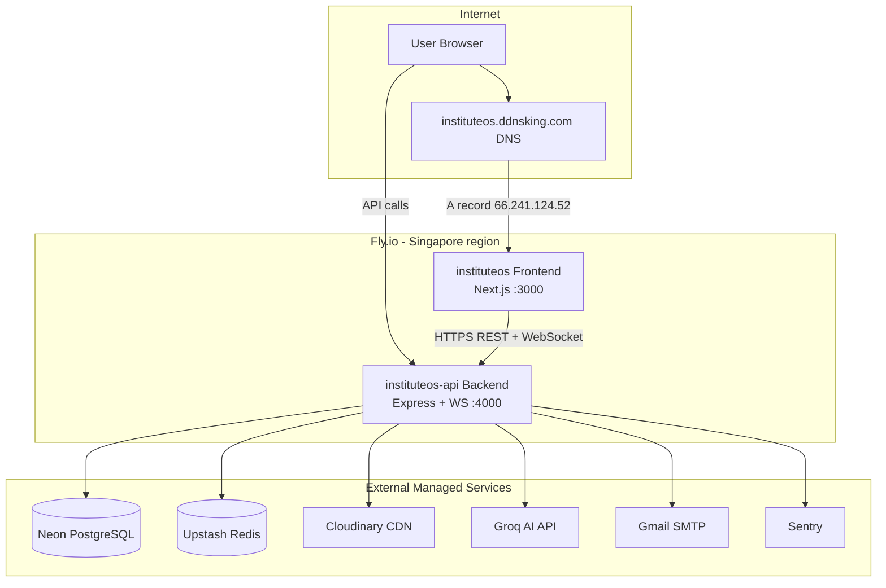
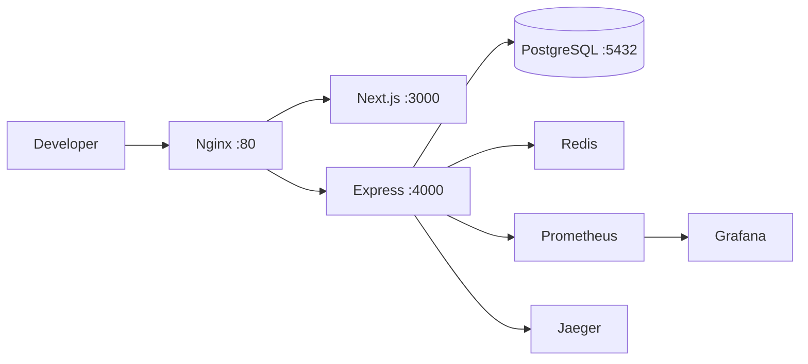

# instituteOS (NexClass) — Complete Project & Interview Guide

> **Product name (UI):** instituteOS  
> **Repo name:** nexclass  
> **Type:** Multi-tenant SaaS for tuition institutes (Sri Lanka focus)  
> **Status:** Live in production on Fly.io  
> **Companion doc:** [`INTERVIEW_QUESTIONS_AND_ANSWERS.md`](./INTERVIEW_QUESTIONS_AND_ANSWERS.md) — 65+ Q&A for mock interviews

---

## Table of Contents

1. [What Is This Project?](#1-what-is-this-project)
2. [Who Uses It & Why It Exists](#2-who-uses-it--why-it-exists)
3. [Complete Feature List](#3-complete-feature-list)
4. [Live Production System — How It Runs 24/7](#4-live-production-system--how-it-runs-247)
5. [Live User Journey — Step by Step](#5-live-user-journey--step-by-step)
6. [System Architecture](#6-system-architecture)
7. [Technology Stack & Why](#7-technology-stack--why)
8. [Codebase Structure](#8-codebase-structure)
9. [Database Design](#9-database-design)
10. [Role-by-Role Flows](#10-role-by-role-flows)
11. [Authentication & Security](#11-authentication--security)
12. [Attendance System (Core Feature)](#12-attendance-system-core-feature)
13. [Billing & Payments](#13-billing--payments)
14. [Background Workers](#14-background-workers)
15. [Testing Strategy](#15-testing-strategy)
16. [Deployment (Local + Production)](#16-deployment-local--production)
17. [Production Issues You Fixed (Interview Stories)](#17-production-issues-you-fixed-interview-stories)
18. [CV Bullet Points](#18-cv-bullet-points)
19. [5-Minute Demo Script](#19-5-minute-demo-script)
20. [API Quick Reference](#20-api-quick-reference)
21. [Glossary](#21-glossary)

---

## 1. What Is This Project?

**instituteOS** is a **full-stack web platform** that digitizes how private tuition institutes operate.

Instead of paper registers, WhatsApp fee reminders, and Excel spreadsheets, one institute gets:

- A **single dashboard** for admins, teachers, students, and parents  
- **Live OTP + GPS attendance** so students cannot mark present from home  
- **Automated monthly billing** with reminders and suspension rules  
- **AI tutor** for students (Groq LLM)  
- **Email invite onboarding** — no open public signup spam  
- **Multi-tenant platform** — one Super Admin can host many institutes  

### Live URLs (Production)

| Service | URL |
|---------|-----|
| **Frontend (main app)** | https://instituteos.fly.dev |
| **Custom domain** | https://instituteos.ddnsking.com |
| **Backend API** | https://instituteos-api.fly.dev/api |
| **API health check** | https://instituteos-api.fly.dev/api/health |
| **Swagger docs** | https://instituteos-api.fly.dev/api/docs |

### Demo Login (Super Admin — seeded in production)

| Field | Value |
|-------|-------|
| Email | `admin@nexclass.com` |
| Password | `Changeme123` |

### One-Sentence Pitch

> "I built a multi-tenant institute management SaaS with five roles, GPS-verified OTP attendance, automated billing, AI tutoring, and deployed it live on Fly.io with full observability."

---

## 2. Who Uses It & Why It Exists

### Target Market

Private **tuition institutes in Sri Lanka** (O/L, A/L, grades 6–13). Same model applies to coaching centers elsewhere.

### The Five Roles

| Role | Who | What they do on the platform |
|------|-----|------------------------------|
| **Super Admin** | Platform owner | Create/deactivate institutes, view cross-platform analytics |
| **Institute Admin** | Tuition center owner/manager | Manage faculty, students, classes, fees, institute GPS settings |
| **Teacher** | Class instructor | Start OTP attendance sessions, upload materials, manual mark, reports |
| **Student** | Enrolled learner | Mark attendance (OTP+GPS), view classes, pay fees, AI tutor |
| **Parent** | Student's guardian | Read-only: child's attendance, fees, classes, notifications |

### Real-World Problems Solved

| Before (manual) | After (instituteOS) |
|-----------------|---------------------|
| Paper attendance register | OTP + GPS verified digital check-in |
| WhatsApp "fee due" messages | Automated billing worker + email alerts |
| Parent calls admin for updates | Parent portal with live data |
| Teacher shows code on whiteboard | Live WebSocket board updates as students check in |
| No audit trail | PostgreSQL records every attendance, payment, login |
| Fake/proxy attendance | Geofencing + enrollment status checks |

---

## 3. Complete Feature List

### Platform & Admin
- [x] Super Admin creates institutes with invite email to Institute Admin  
- [x] Institute settings: billing cycle, grace period, auto-suspend days, geofence radius, campus GPS  
- [x] Institute deactivation blocks all its users  
- [x] Platform analytics dashboard  

### Users & Onboarding
- [x] Invite-only registration (48-hour token links)  
- [x] Faculty invite (teachers)  
- [x] Student registration with optional class enrollment  
- [x] Parent auto-created when student has parent email  
- [x] Student profile + verification workflow (PENDING → VERIFIED)  
- [x] Profile photo upload (Cloudinary)  
- [x] Password reset via email  
- [x] Soft delete / deactivate users  

### Classes & Enrollment
- [x] Create classes: subject, grade, teacher, fee, schedule  
- [x] Enroll students in classes  
- [x] Students see **only their enrolled classes** (RBAC)  
- [x] Enrollment status: ACTIVE, PAYMENT_DUE, SUSPENDED, CANCELLED  

### Attendance
- [x] Teacher starts live OTP session per class  
- [x] 6-digit OTP displayed on teacher screen  
- [x] Student submits OTP + GPS coordinates  
- [x] Haversine geofence check vs institute location  
- [x] Real-time WebSocket attendance board  
- [x] Manual attendance override by teacher  
- [x] End session → absent notifications to student + parents  
- [x] Attendance blocked if fees overdue (configurable)  

### Payments
- [x] Automated PaymentDue creation on billing date  
- [x] Student marks "Ready to Pay"  
- [x] Admin/Teacher records offline payment  
- [x] Payment history and status tracking  

### Materials & Live Sessions
- [x] PDF upload to Cloudinary per class  
- [x] Video/live session links (YouTube, Zoom, etc.)  

### AI Tutor
- [x] Groq-powered chat (`llama-3.3-70b-versatile`)  
- [x] Chat history stored per student  
- [x] Rate limit: 20 req/min per user  

### Notifications
- [x] In-app notification center  
- [x] Email: invites, enrollment, fee due, password reset, absent alerts  

### Security & Compliance
- [x] JWT access + refresh token rotation  
- [x] Login lockout (5 fails / 15 min)  
- [x] RBAC on every route  
- [x] GDPR data export + account deletion  
- [x] Nightly data retention worker  

### DevOps & Observability
- [x] Docker Compose local stack  
- [x] Fly.io production deploy  
- [x] Prometheus metrics + Grafana dashboards  
- [x] Jaeger tracing, Loki logs, Sentry errors  
- [x] Vitest, Playwright, k6 tests  
- [x] GitHub Actions CI  

---

## 4. Live Production System — How It Runs 24/7

This section answers: **"What actually happens when someone uses the live site?"**

### 4.1 Production Infrastructure Map



### 4.2 What Runs Where

| Component | Where | Purpose |
|-----------|-------|---------|
| Next.js frontend | Fly app `instituteos` | UI, landing page, dashboards |
| Express API + WebSocket | Fly app `instituteos-api` | REST API, attendance WS, workers |
| PostgreSQL | Neon (cloud) | All persistent data |
| Redis | Upstash (serverless) | OTP cache, login lockout, rate limits |
| Files (PDF, images) | Cloudinary | No file storage on Fly VM |
| AI chat | Groq API | External LLM |
| Email | Gmail SMTP | Invites, alerts |
| Errors | Sentry | Production error tracking |
| DNS | ddnsking.com → Fly IP | Custom domain for frontend |

### 4.3 What Starts When Backend Boots (`server.ts`)

When Fly.io starts the backend container, this happens **in order**:

1. **OpenTelemetry tracing** initializes (`initTracing()`)  
2. **Express app** mounts on HTTP server  
3. **WebSocket server** starts on path `/ws/attendance`  
4. **Billing worker** starts (node-cron — checks enrollments every N minutes)  
5. **Retention worker** starts (nightly GDPR cleanup at 02:00 UTC)  
6. **Redis attendance broadcast** handler initializes  
7. Server listens on port **4000**  

**Docker entrypoint** (before Node starts):
```bash
npx prisma migrate deploy    # Apply DB migrations to Neon
node seed-prod.js            # Ensure super admin exists
node dist/server.js          # Start API
```

### 4.4 Single HTTP Request Lifecycle (Production)

Example: Student marks attendance on live site.

```
1. Browser (instituteos.fly.dev)
      ↓ HTTPS
2. Fly.io edge (TLS termination)
      ↓
3. Next.js serves page OR axios calls instituteos-api.fly.dev
      ↓
4. Express middleware chain:
   helmet → CORS check → rate limit → sanitize → metrics → logger
      ↓
5. authenticate() — verify JWT Bearer token
      ↓
6. requireRole('STUDENT') — RBAC check
      ↓
7. validate(Zod schema) — { otpCode, classId, latitude, longitude }
      ↓
8. attendance.service.verifyOtp() — business logic
      ↓
9. Prisma → Neon PostgreSQL (read session, write attendance_record)
      ↓
10. Redis (optional OTP cache)
      ↓
11. WebSocket broadcast → teacher's live board updates
      ↓
12. JSON response { success: true } → student UI shows success
```

### 4.5 CORS & Cross-Origin Auth (Production Detail)

Frontend and API are on **different Fly.io subdomains**:
- Frontend: `https://instituteos.fly.dev`
- API: `https://instituteos-api.fly.dev`

This requires:
- `CORS_ORIGINS=https://instituteos.fly.dev,https://instituteos.ddnsking.com` on backend  
- Axios `withCredentials: true` for refresh cookie  
- Refresh cookie: `SameSite=None; Secure=true` in production  
- Access token in `sessionStorage` (survives page refresh within tab)  

### 4.6 Background Processes Running 24/7

| Process | Schedule | What it does |
|---------|----------|--------------|
| Billing worker | Every 10 min (configurable) | Creates fee dues, sends reminders, suspends overdue |
| Retention worker | Daily 02:00 UTC | Deletes old AI chats, notifications, expired tokens |
| WebSocket server | Always on | Teacher live attendance boards |
| Health endpoint | On demand | `/api/health` — uptime, circuit breaker status |

### 4.7 Deploy Flow (How You Push Updates Live)

```bash
# Backend
cd backend
fly secrets set DATABASE_URL=... JWT_SECRET=...   # one-time
fly deploy

# Frontend (build bakes NEXT_PUBLIC_API_URL)
cd frontend
fly deploy --build-arg NEXT_PUBLIC_API_URL=https://instituteos-api.fly.dev/api
```

Fly builds Docker image → runs entrypoint (migrate + seed) → health check passes → traffic routes to new machine.

---

## 5. Live User Journey — Step by Step

### Journey 1: New Institute Onboarding (End to End)

```
Super Admin logs in
  → Creates "Colombo Maths Academy"
  → System creates Institute + InstituteSettings + UserInvite
  → Email sent to institute admin with /invite?token=abc123

Institute Admin clicks email link
  → Sets password on /invite page
  → Lands on admin dashboard
  → Settings: sets campus GPS (lat/lng), geofence radius, billing rules

Admin invites Teacher
  → Teacher gets email → sets password → sees My Classes

Admin registers Student (with class)
  → Student gets email → sets password
  → Parent email provided → Parent gets separate invite

Student completes profile → submits for verification
Admin verifies student in person → status VERIFIED

Teacher starts class session → OTP shown
Student opens Mark Attendance → picks class → enters OTP + GPS
  → Attendance recorded → teacher board updates live
```

### Journey 2: Monthly Fee Cycle (Automated)

```
Day 1: Student enrolled → nextBillingDate = +30 days, status ACTIVE

Day 30: Billing worker runs
  → Creates PaymentDue (UNPAID, LKR amount from class fee)
  → Enrollment → PAYMENT_DUE
  → Email: "Fee Due — Physics A/L"

Day 30–37: Grace period (institute setting)
  → Student can still mark attendance

Day 37+: autoSuspendAfterDays reached
  → Enrollment → SUSPENDED
  → Student tries attendance → 403 "Attendance blocked — fees overdue"

Student marks "Ready to Pay" → PAYMENT_READY
Admin records cash payment → PAID → ACTIVE again
```

### Journey 3: Teacher Live Class (Real-Time)

```
09:00 — Teacher opens Attendance → Start Session → Physics A/L
        POST /attendance/sessions { classId }
        Response: { sessionId, otpCode: "482910" }
        WebSocket connects

09:01 — Teacher writes OTP on board / shows on projector

09:02 — Student A opens Mark Attendance
        Selects "Physics A/L" (only enrolled classes shown)
        Enters 482910
        Browser gets GPS: (6.9271, 79.8612)
        POST /attendance/verify-otp

09:02 — Backend:
        ✓ Session ONGOING for that class
        ✓ OTP matches DB
        ✓ Distance 45m < 1000m geofence
        ✓ Enrollment ACTIVE
        → Creates attendance_record
        → WebSocket: { type: STUDENT_CHECKED_IN, studentName: "Amara" }

09:02 — Teacher screen: "Amara checked in" — present count 1/25
```

---

## 6. System Architecture

### High-Level (3 Tiers)

```
┌─────────────────────────────────────────────────────────┐
│  PRESENTATION — Next.js 15 (React 19, Tailwind, Zustand) │
│  Role-based sidebar, dashboards, forms, WebSocket client │
└──────────────────────────┬──────────────────────────────┘
                           │ HTTPS REST + WSS
┌──────────────────────────▼──────────────────────────────┐
│  APPLICATION — Express 4 + TypeScript                    │
│  Modular monolith: auth, class, attendance, payment, ai  │
│  Middleware: JWT, RBAC, Zod, rate limit, bulkhead        │
│  Workers: billing cron, retention cron                     │
│  WebSocket: /ws/attendance                               │
└──────────────────────────┬──────────────────────────────┘
                           │ Prisma ORM
┌──────────────────────────▼──────────────────────────────┐
│  DATA — Neon PostgreSQL + Upstash Redis + Cloudinary     │
└─────────────────────────────────────────────────────────┘
```

### Backend Layer Pattern

```
HTTP Request
  → Express Middleware (helmet, cors, rate-limit, sanitize, logger, metrics)
  → Route + requireRole() + validate(Zod)
  → Controller (thin — HTTP only)
  → Service (business logic)
  → Prisma / Redis / Cloudinary / Groq
```

### Local Development Stack



Run: `docker compose up` → open `http://localhost`

---

## 7. Technology Stack & Why

| Technology | Why |
|------------|-----|
| **TypeScript** | End-to-end type safety |
| **Express + Prisma + PostgreSQL** | Relational billing/enrollment needs ACID |
| **Next.js 15** | App Router, fast dashboards, landing page |
| **Zustand** | Simple auth state |
| **JWT + httpOnly cookie** | XSS-resistant refresh token |
| **Upstash Redis** | Serverless — no self-hosted Redis on Fly |
| **Cloudinary** | Zero file storage ops |
| **Groq** | Fast/cheap LLM for AI tutor |
| **WebSocket (ws)** | Live attendance board |
| **Fly.io** | Simple HTTPS deploy for FE + BE |
| **Neon** | Managed Postgres — DB not on small VM |
| **Prometheus + Grafana + Jaeger + Sentry** | Production observability |

---

## 8. Codebase Structure

```
nexclass/
├── backend/src/
│   ├── app.ts              # Express setup, health, CORS
│   ├── server.ts           # HTTP + WebSocket + workers
│   ├── routes/v1.ts        # All /api/v1 routes
│   ├── modules/
│   │   ├── auth/           # Login, refresh, invites
│   │   ├── attendance/     # OTP, geofence, WebSocket
│   │   ├── payment/        # Dues + billing.worker.ts
│   │   ├── class/          # Classes CRUD + student filter
│   │   ├── student/        # Registration, verification
│   │   ├── parent/         # Read-only child APIs
│   │   ├── ai/             # Groq tutor
│   │   └── notification/   # Email + in-app
│   ├── middleware/         # auth, role, validate, rate limit
│   └── prisma/schema.prisma
├── frontend/src/
│   ├── app/(auth)/         # login, invite, reset-password
│   ├── app/(dashboard)/    # all role pages
│   ├── components/layout/sidebar.tsx  # role-based nav
│   └── lib/api.ts + store.ts
├── docs/
│   ├── PROJECT_INTERVIEW_GUIDE.md      ← this file
│   └── INTERVIEW_QUESTIONS_AND_ANSWERS.md ← 65+ Q&A
├── observability/          # Grafana, Prometheus configs
└── docker-compose.yml
```

---

## 9. Database Design

**File:** `backend/prisma/schema.prisma`

### Entity Relationships

```
Institute ──1:1── InstituteSettings (GPS, billing rules)
    │
    ├── User (SUPER_ADMIN | INSTITUTE_ADMIN | TEACHER | STUDENT | PARENT)
    ├── TuitionClass ── assigned Teacher (User)
    └── Student ── linked User

Student ──*:*── TuitionClass  via StudentEnrollment
StudentEnrollment ──1:*── PaymentDue

TuitionClass ──1:*── AttendanceSession ──1:*── AttendanceRecord

Parent (User) ──*:*── Student  via ParentStudentLink
```

### Key Enums

| Enum | Values |
|------|--------|
| `Role` | SUPER_ADMIN, INSTITUTE_ADMIN, TEACHER, STUDENT, PARENT |
| `VerificationStatus` | PENDING_PROFILE → PENDING_VERIFICATION → VERIFIED |
| `SubscriptionStatus` | ACTIVE, PAYMENT_DUE, SUSPENDED, CANCELLED |
| `PaymentStatus` | UNPAID, PAYMENT_READY, PAID |
| `SessionStatus` | ONGOING, COMPLETED |

---

## 10. Role-by-Role Flows

### Super Admin
**Pages:** Dashboard, Analytics, Institutes, Users, Settings  
**Key action:** Create institute → admin gets invite email

### Institute Admin
**Pages:** Dashboard, Faculty, Students, Classes, Attendance, Payments, Settings  
**Key actions:** Register student, verify student, create class, enroll, record payment, set campus GPS

### Teacher
**Pages:** Dashboard, My Classes, Attendance, Materials, Live Sessions, Reports  
**Key actions:** Start OTP session, manual mark, upload PDF, end session

### Student
**Pages:** Dashboard, My Classes, Mark Attendance, AI Tutor, My Fees, Profile  
**Key actions:** Submit OTP+GPS, mark ready to pay, chat with AI tutor

### Parent
**Pages:** Children, Attendance, Fees, Classes (all read-only)  
**Key action:** Monitor linked child's data

---

## 11. Authentication & Security

### Login Flow
1. `POST /api/v1/auth/login` → bcrypt verify → JWT access (15m) + refresh (7d)  
2. Refresh stored in DB + httpOnly cookie  
3. Access token in sessionStorage  
4. On 401 → auto refresh via cookie → retry request  

### Security Layers
- Helmet headers  
- CORS whitelist  
- Global + login + per-user rate limits  
- Login lockout (Redis, 5 fails / 15 min)  
- Zod input validation  
- PII redaction in logs  
- Circuit breakers on Groq/Cloudinary  
- Bulkhead concurrency limits (AI: 10, Upload: 5)  
- Institute active check on every authenticated request  
- GDPR export/delete endpoints  

---

## 12. Attendance System (Core Feature)

### How OTP + GPS Works

1. Teacher starts session → 6-digit OTP generated (`crypto.randomInt`)  
2. Saved to `attendance_sessions.otp_code` (PostgreSQL = source of truth)  
3. Optionally cached in Redis `otp:{sessionId}`  
4. Student submits `{ otpCode, classId, latitude, longitude }`  
5. Backend finds ONGOING session for class  
6. Compares OTP (string coercion — fixed prod bug)  
7. Haversine distance check vs institute lat/lng  
8. Checks enrollment not SUSPENDED  
9. Creates `attendance_records` row  
10. WebSocket broadcast to teacher  

### Geofence Formula
`backend/src/utils/haversine.ts` — distance in meters vs `geofenceRadiusMeters` (default 1000m).

### WebSocket
Path: `/ws/attendance?token=JWT&sessionId=UUID`  
Teacher clients registered in `sessionClients` Map.  
On check-in: `broadcastAttendance()` → all teacher clients for that session update.

---

## 13. Billing & Payments

```
Enrollment created → nextBillingDate set
        ↓
Billing worker (cron) when date reached:
  → PaymentDue (UNPAID)
  → enrollment PAYMENT_DUE
  → email notification
        ↓
Grace period (institute setting)
        ↓
autoSuspendAfterDays → SUSPENDED (blocks attendance)
        ↓
Student: PAYMENT_READY → Admin: record payment → PAID → ACTIVE
```

**File:** `backend/src/modules/payment/billing.worker.ts`

---

## 14. Background Workers

| Worker | File | Schedule |
|--------|------|----------|
| Billing | `payment/billing.worker.ts` | Configurable cron (10 min prod / 5 min test) |
| Data retention | `workers/retention.worker.ts` | Daily 02:00 UTC |

Both started in `server.ts` alongside the HTTP server.

---

## 15. Testing Strategy

| Type | Tool | Command |
|------|------|---------|
| API integration | Vitest | `cd backend && npm test` |
| E2E per role | Playwright | `cd frontend && npx playwright test` |
| Load (25 users) | k6 | `k6 run tests/load/load-test.js` |
| CI | GitHub Actions | Lint + test + build on push |

---

## 16. Deployment (Local + Production)

### Local
```bash
docker compose up
# → http://localhost (Nginx → frontend + backend)
```

### Production (Fly.io)
| App | Directory | Port |
|-----|-----------|------|
| `instituteos` | `frontend/` | 3000 |
| `instituteos-api` | `backend/` | 4000 |

**Secrets:** DATABASE_URL, JWT_SECRET, REDIS_URL, CLOUDINARY_*, GROQ_API_KEY, SMTP_*, CORS_ORIGINS, FRONTEND_URL, BYPASS_GEOFENCING

**Database:** Neon PostgreSQL (not on Fly VM)

---

## 17. Production Issues You Fixed (Interview Stories)

Use these as **STAR stories** — they prove real production experience.

### Story 1: Login Failed in Browser but Worked in Postman
- **Cause:** Wrong `NEXT_PUBLIC_API_URL` baked into Docker build; CORS misconfiguration; missing `trust proxy`  
- **Fix:** Separate `FRONTEND_URL` vs `CORS_ORIGINS`; `app.set('trust proxy', 1)`; rebuild frontend with correct API URL  
- **Lesson:** Cross-origin auth needs SameSite=None cookies + correct build-time env vars  

### Story 2: Parent Redirected to Login After Dashboard
- **Cause:** `window.location.href` full reload wiped token; refresh cookie not sent cross-origin  
- **Fix:** `router.replace('/children')`; sessionStorage for access token; SameSite=None on refresh cookie  

### Story 3: Student Saw All Institute Classes
- **Cause:** `GET /classes` had no role filter for students  
- **Fix:** `findForStudent(studentId)` — only enrolled classes returned  

### Story 4: Valid OTP Rejected
- **Cause:** Redis returned numeric OTP; stale Redis value overrode DB; frontend sent wrong field names  
- **Fix:** PostgreSQL `session.otpCode` as source of truth; string coercion; frontend sends `otpCode, classId, latitude, longitude`  

### Story 5: GPS Timeout on Desktop
- **Cause:** Desktop browsers often cannot get GPS in time  
- **Fix:** `BYPASS_GEOFENCING=true` for testing; frontend fallback coordinates; health endpoint exposes bypass flag  

---

## 18. CV Bullet Points

Pick 4–6 for your CV:

- Built **full-stack multi-tenant SaaS** for tuition institutes with **5 user roles** and live production deploy on **Fly.io + Neon PostgreSQL**.  
- Implemented **GPS + OTP attendance** with Haversine geofencing, WebSocket live board, and PostgreSQL/Redis OTP verification.  
- Developed **automated billing worker** (node-cron) for fee dues, email reminders, and enrollment suspension.  
- Designed **JWT auth** with refresh rotation, Redis login lockout, and RBAC on 40+ API endpoints.  
- Built **Next.js 15 dashboard** with role-based navigation, Zustand, and axios token refresh interceptors.  
- Integrated **Groq AI tutor**, Cloudinary uploads, SMTP invite emails, and **Prometheus/Grafana/Sentry** observability.  
- Wrote **Vitest + Playwright + k6** tests; configured **GitHub Actions CI** and Docker Compose dev stack.  

**Tech line:**  
`TypeScript, Node.js, Express, Prisma, PostgreSQL, Redis, Next.js, React, Docker, Fly.io, WebSocket, Prometheus, Sentry`

---

## 19. 5-Minute Demo Script

1. Open https://instituteos.fly.dev — show landing page (roles, features)  
2. Login Super Admin → show Institutes list  
3. Login Institute Admin → Students → register student  
4. Login Teacher → Attendance → Start Session → **show OTP on screen**  
5. Login Student → Mark Attendance → select class → enter OTP → success  
6. Mention: "Billing runs automatically, parents get read-only portal, AI tutor uses Groq"  

---

## 20. API Quick Reference

Base: `https://instituteos-api.fly.dev/api/v1`

| Area | Key Endpoints |
|------|---------------|
| Auth | `POST /auth/login`, `POST /auth/refresh`, `GET /auth/me` |
| Institutes | `GET/POST /institutes` (Super Admin) |
| Students | `POST /students`, `PATCH /students/:id/verify` |
| Classes | `GET/POST /classes` |
| Enrollments | `POST /enrollments` |
| Attendance | `POST /attendance/sessions`, `POST /attendance/verify-otp`, `POST /attendance/manual` |
| Payments | `GET /payments`, `POST /payments/:id/record`, `PATCH /payments/:id/ready` |
| AI | `POST /ai/chat` |
| Parent | `GET /parent/children`, `GET /parent/children/:id/attendance` |
| Health | `GET /api/health` |
| Docs | `GET /api/docs` |

Full Swagger: https://instituteos-api.fly.dev/api/docs

---

## 21. Glossary

| Term | Meaning |
|------|---------|
| Institute | A tuition center (tenant) |
| TuitionClass | Subject class with fee, schedule, teacher |
| Enrollment | Student subscribed to a class |
| PaymentDue | One billing period fee record |
| AttendanceSession | One class period with OTP code |
| UserInvite | 48h token link for password setup |
| Geofencing | GPS distance check vs institute location |
| Soft delete | `isDeleted=true`, data kept for audit |
| Bulkhead | Concurrency limit to prevent overload |
| Circuit breaker | Stop calling failing external service |

---

## Next Step: Mock Interview

Open **[INTERVIEW_QUESTIONS_AND_ANSWERS.md](./INTERVIEW_QUESTIONS_AND_ANSWERS.md)** — 65+ questions with full answers organized by topic. Practice Sections A, B, and E first (project overview, live flows, attendance).

---

*Last updated: June 2026 — reflects live Fly.io deployment with Neon PostgreSQL.*
